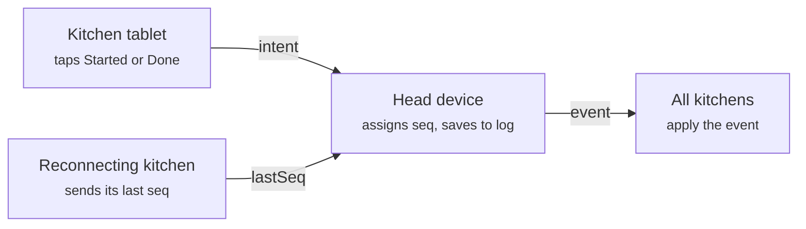

# Yes Chef — Spec

2026-10-04 · Amelia Mowers

## Overview

Yes Chef is a backend-free PWA (Progressive Web App) that routes orders from one front-of-house tablet to one or more kitchen tablets on the same Wi-Fi. It is minimal by design: big buttons, three screens, and an event log that gives history and undo for free.

**Goals**

- Take an order in a few taps and send it to the kitchen instantly.
- Let the kitchen move tickets through statuses with big, glove-friendly buttons.
- Keep a full order history and support undo on both ends.
- Run as a static site with no server to operate.

**Non-goals (for now)**

- Prices, totals, payments, or tax. This is order routing only.
- More than one head device.
- Accounts, logins, or cloud sync.

## Architecture

One head device owns all state and relays everything; kitchen devices are thin clients. No distributed data structures: the head is the single source of truth.

- **Client:** static PWA with a service worker for offline loading. Data lives in IndexedDB (the browser's local database).
- **Transport:** WebRTC (Web Real-Time Communication) data channels between tablets, set up through **Trystero** (PeerJS as fallback). Signaling goes through public relays; order data flows peer-to-peer over the local Wi-Fi.
- **Roles:** the head device runs the order screen, menu designer, and event log. Kitchen devices render tickets and send status intents back.
- **Hosting:** GitHub Pages for development, served from `/yes-chef/`. Later, Cloudflare Pages on a custom domain.
- **Path rule:** all asset paths and the service worker scope are relative, so the move to a root domain needs no code changes.
- **Origin move:** IndexedDB and installed PWAs are tied to the domain, so data will not follow the move to Cloudflare. Menu and history export/import ships from day one to cover this.

## Screens

The app opens to a role choice: **Head** (order taking) or **Kitchen**. Everything stays minimal, with large touch targets.

### Order (head device)

1. A grid of big category buttons (Burgers, Drinks, Sides).
2. Tapping a category opens a sheet with its items. Picking an item shows its modifier groups, a quantity control, and an optional note.
3. Confirmed items go onto the current ticket, shown in a side panel.
4. The ticket has an optional **name** field and a big **Send** button.
5. After sending, an **Undo** toast stays up for about 10 seconds.

Sent orders can be opened from history and **modified** or **cancelled**; the kitchen sees the change highlighted.

### Menu designer

- Create and edit categories, items, and modifier groups.
- A modifier group is single- or multi-choice, and required or optional.
- **Publish** pushes the menu to the order screen and to paired kitchens.
- **Export / import** the menu as JSON (JavaScript Object Notation).
- **Backup:** an automatic snapshot before every publish or import, restorable from a list.
- **Load test menu:** fills in a sample menu so the normal flow can be tried end to end. If a menu or history already exists, it warns first and offers to export a backup.

### Kitchen

- First run shows an in-app QR (Quick Response) code scanner, with a typed short-code fallback.
- After pairing, open tickets show as cards, oldest first, with the name, items, modifiers, and age.
- Each card has big status buttons, such as **Started** and **Done**. Which ones appear depends on Settings.
- **Recall** brings back the last ticket marked done (the kitchen undo).
- A connection badge shows whether the head device is reachable.

### History

- Available on both device types, read from the event log.
- Filter by status, time, or name. Undone events show greyed out.
- Open any order to see its full timeline of events.

### Settings

- **Status checkboxes:** choose which kitchen statuses are active. Default is **Done** only; **Started** and **Picked up** are optional.
- Pairing: show the QR code, regenerate the room code, see connected kitchens.
- Data: export everything, import, clear history.
- Screen wake lock on or off (defaults on for kitchens).

## Event model, history and undo

Every change is an append-only event in a log owned by the head device. Current state is a replay of that log, so history and undo come from the same structure.

```json
{
  "seq": 42,
  "id": "evt_7f3a",
  "type": "order.modified",
  "orderId": "ord_12",
  "payload": { "changes": [] },
  "device": "kitchen-1",
  "ts": 1791234567890
}
```

| Event type | Raised by | Meaning |
| --- | --- | --- |
| `order.created` | Head | A new order was sent |
| `order.modified` | Head | Items, modifiers, name, or note changed |
| `order.cancelled` | Head | The order is void |
| `status.changed` | Kitchen (via head) | Order moved to a new status, such as Started or Done |
| `undo` | Either | Reverses the event with `targetSeq` |
| `menu.published` | Head | A new menu version is live |
| `settings.changed` | Head | Enabled statuses or other settings changed |

**Rules**

- `seq` is assigned only by the head device, so there is one total order.
- Events are never edited or deleted. **Undo is a new `undo` event** pointing at `targetSeq`; replay skips undone events.
- Undo of an undo re-applies the original (redo).
- Kitchen **Recall** is an `undo` of the latest `status.changed` to Done.
- Order screen **Undo** within 10 seconds is an `undo` of `order.created`; the kitchen card disappears.
- Orders store a snapshot of the menu items they used, so later menu edits never rewrite history.

## Pairing and sync

Kitchens pair once by scanning a QR code on the head device, then reconnect on their own. All changes flow through the head device.



*Every change passes through the head device. On reconnect, the head replays every event after `lastSeq`.*

Kitchens never change state directly. They send an intent, and the head device stamps it with the next `seq`, saves it, and broadcasts it to every kitchen, including the sender.

**Pairing**

1. The head device generates a fixed **room code** per restaurant (regenerable in Settings) and a shared secret.
2. Settings shows a QR code holding the app URL, room code, and secret, plus a short typed code as a fallback.
3. The kitchen scans it with the **in-app scanner**. A tablet's own camera app would open the link in the browser instead of the installed PWA.
4. The kitchen joins the Trystero room and stores the pairing, so it auto-joins on every launch.
5. On join, the kitchen sends `hello { lastSeq }` and the head replies with the current menu, settings, and all events after `lastSeq`.

**Reliability**

- Each intent carries an ID. The kitchen resends until it sees the matching event come back, and the head ignores duplicates.
- If the head is unreachable, kitchens keep showing the last known tickets read-only and queue taps until it returns.
- Messages are encrypted with the shared secret, since signaling goes through public relays.

## Data model

Two documents matter: the menu, which is versioned, and the order, which is derived by replaying events.

**Menu** (also the export/import format)

```json
{
  "version": 3,
  "categories": [
    { "id": "cat_burgers", "name": "Burgers", "color": "#E07A5F",
      "items": [
        { "id": "itm_classic", "name": "Classic Burger",
          "modifierGroups": ["mg_temp", "mg_extras"] }
      ] }
  ],
  "modifierGroups": [
    { "id": "mg_temp", "name": "Temperature", "select": "single", "required": true,
      "options": [{ "id": "opt_mr", "name": "Medium rare" }, { "id": "opt_wd", "name": "Well done" }] },
    { "id": "mg_extras", "name": "Extras", "select": "multi", "required": false,
      "options": [{ "id": "opt_bacon", "name": "Add bacon" }, { "id": "opt_noonion", "name": "No onion" }] }
  ]
}
```

**Order** (rebuilt from events)

```json
{
  "id": "ord_12",
  "number": 12,
  "name": "Sam",
  "status": "done",
  "lines": [
    { "itemName": "Classic Burger", "qty": 2,
      "modifiers": ["Medium rare", "Add bacon"], "note": "" }
  ],
  "createdSeq": 40,
  "updatedSeq": 44
}
```

- Order lines store item and modifier **names**, not just IDs, so history survives menu edits.
- Order numbers count up per day and reset at local midnight.
- A full backup is one JSON file: `{ menu, settings, events }`.

## Risks, open questions, later

**Risks**

- **Tablets sleeping:** iPads especially drop WebRTC connections in the background. Mitigation: Screen Wake Lock API, auto-reconnect, and replay from `lastSeq`.
- **No internet:** Trystero needs the internet for signaling. Fallback: manual QR offer/answer pairing that stays on the LAN (local area network).
- **Head device loss:** the log lives only on the head. Mitigation: frequent export reminders; later, kitchens could hold a mirror copy.
- **Domain move:** data stays on the old origin. Mitigation: export/import from day one.

**Open questions**

- [ ] Should a kitchen be able to filter to certain categories (grill vs. drinks station)?
- [ ] Sound or flash alert on new or modified tickets?
- [ ] How long to keep history before offering to archive it?
- [ ] Does Undo after the 10-second toast live only in History, or also on the order screen?

**Later**

- Multiple head devices.
- Prices and totals.
- Station routing, so items go to specific kitchen screens.
- Cloudflare Pages on a custom domain.
